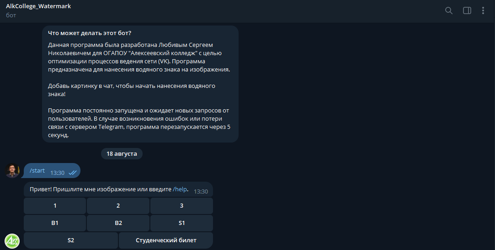
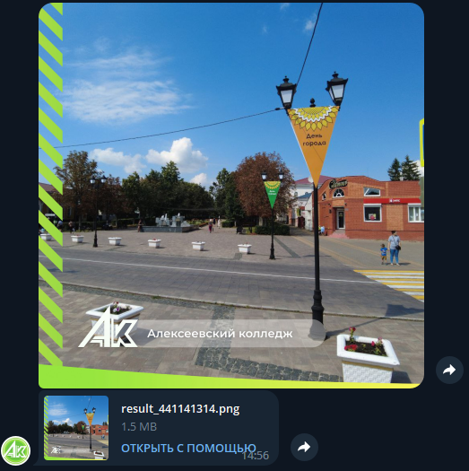

# Telegram_bot_Add_Watermark
This program is designed to create a Telegram bot that implements the ability to add watermarks to images. It caters to both PC and Android versions. Users press a button and select an image. Afterward, they choose the watermark they want to apply to the image. Upon selection, the Telegram bot sends the modified image with the watermark.

Description:

Watermark Telegram Bot is a versatile and user-friendly program designed to add watermarks to images for Telegram users. Whether you are using the PC version or the Android version of Telegram, this bot provides an easy way to overlay watermarks on your images, helping protect your content and add a professional touch to your media.

Features:

Seamless Watermarking: Users can effortlessly apply watermarks to their images by simply selecting the desired image and the watermark they want to use.
Extensive Watermark Library: The bot offers a rich collection of pre-defined watermarks that users can choose from. This is especially helpful for newcomers who may not be familiar with different watermark options.
Non-Standard Request Handling: The bot is equipped to handle non-standard user requests gracefully, providing a smooth user experience.
Preview Watermarks: Users can preview all available watermarks, allowing them to see how they will appear on their images before making the final selection.
Intuitive Button System: The program is designed with an intuitive button system, making it easy for users to navigate and set preferences or tasks during their interaction with the bot.
Advantages:

User-Friendly Interface: Watermark Telegram Bot offers an intuitive and easy-to-use interface, making it accessible to users of all skill levels.
Efficient and Time-Saving: Adding watermarks to images can be a time-consuming task. However, with this bot, users can quickly and efficiently watermark their images within Telegram, eliminating the need for external watermarking tools.
Content Protection: Watermarking images is an effective way to protect them from unauthorized usage and ensures proper attribution to the original creator.
Visual Appeal: Watermarks can enhance the visual appeal of images, giving them a professional and branded look.
How to Use:

Start the Watermark Telegram Bot in Telegram by clicking on the "Start" button or typing /start.
Select an image you want to watermark from your device or gallery.
Choose a watermark from the provided list of pre-defined watermarks.
The bot will apply the selected watermark to the image and send the modified image back to you.
Enjoy your watermarked image!
Screenshots:

RU//

Данная программа предназначена для создания телеграм-бота, который позволяет пользователям добавлять водяные знаки на изображения. Это может быть как версия для ПК, так и для Android. Пользователь нажимает и выбирает изображение, затем выбирает водяной знак, который хочет применить к изображению. После выбора, Telegram бот отправляет измененное изображение с водяным знаком.

Следует отметить, что программа обладает функцией ответа на нестандартные запросы пользователя, а также предоставляет возможность просмотра всех доступных водяных знаков с их визуальным представлением и прочими деталями. Это значительно облегчает работу для новых пользователей, которые не знают, какие водяные знаки доступны.

Также в программе реализована система кнопок, которая позволяет пользователю управлять настройками и задачами в процессе работы с ботом.

Если у вас возникнут вопросы, замечания или предложения, я буду рад ответить на них и, при необходимости, внести соответствующие поправки в программу.
